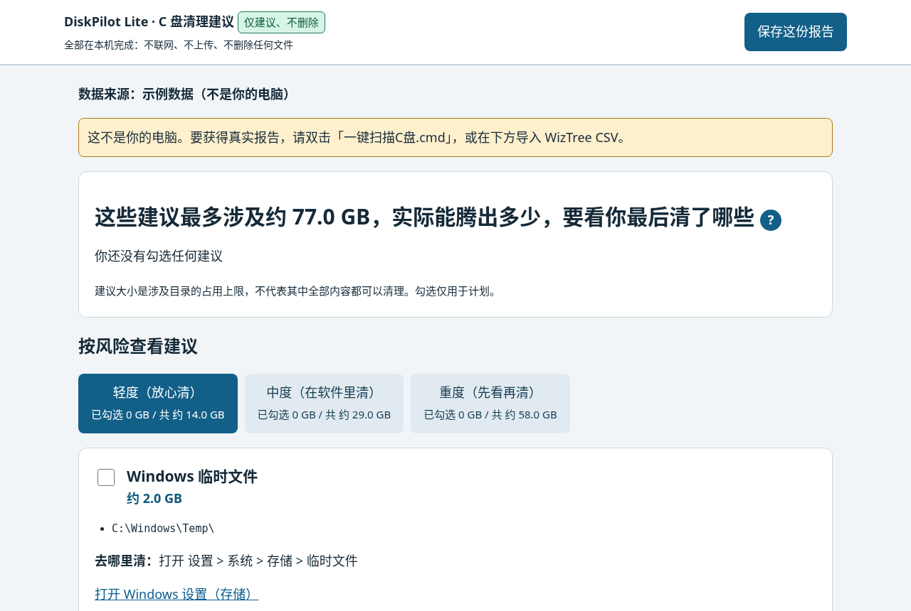

# DiskPilot Lite · C 盘空间报告
中文用户请下载 DiskPilot-Lite-0.3.0-cn-win.zip · English users: download DiskPilot-Lite-0.3.0-en-win.zip

[English](README.md)

[](https://github.com/xpeng5278-web/diskpilot-lite/releases/latest) [](LICENSE)

> C 盘满了？双击一次，拿到一份看得懂的「C 盘清理建议报告」。
> **仅建议、不删除**：本工具不会删除或移动你的任何文件，全部在你自己的电脑上完成，不上传任何数据。



*报告示例截图（示例数据）*

## 怎么用（3 步）

1. **下载压缩包**：从 [Releases 页面](https://github.com/xpeng5278-web/diskpilot-lite/releases/latest) 下载 `DiskPilot-Lite-0.3.0-cn-win.zip`。
2. **右键压缩包 →「全部解压缩」**。一定要先解压，直接在压缩包里双击是不行的（工具会提示「请先右键解压，再双击」）。
3. 打开解压出来的文件夹，**双击 `一键扫描C盘.cmd`**。大约 1～2 分钟后，报告会自动在浏览器里打开。

### 过程中可能出现的 3 个提示（都是正常的）

| 你会看到 | 怎么做 |
| --- | --- |
| 蓝色窗口「Windows 已保护你的电脑」（SmartScreen） | 点 **「更多信息」→「仍要运行」**。这是因为本工具是新发布的小工具，还没有微软的签名。 |
| 黑色窗口里问你要不要安装 WizTree（只在电脑上没有 WizTree 时出现） | 安装即表示同意 WizTree 的[许可协议](https://diskanalyzer.com/eula)（个人免费）。输入 **Y** 或 **是** 后按回车才会安装（从 Windows 自带的 winget 官方软件源下载，约 5～8 MB）；直接按回车或输入其他内容 = 不安装。安装过程中出现的英文进度是正常的，不需要你做任何选择。 |
| 「是否允许此应用对你的设备进行更改？」（管理员确认） | 点 **「是」**。需要管理员权限才能快速读取磁盘，1～2 分钟就能扫完；点「否」也可以，会改用慢速模式（可能要 10 分钟以上，请耐心等，不要关闭窗口）。 |

扫描完成后：
- 报告自动打开，黑色窗口最后会显示「报告已打开，可以关掉这个窗口了」。
- 扫描时产生的临时表格文件（CSV）会被自动删除，删除前会显示它的完整路径。除此之外本工具不碰任何文件。
- 报告里点 **「保存这份报告」** 会另存一份 `DiskPilot报告-日期.html` 到浏览器的「下载」文件夹，按 Ctrl+J 可以直接打开下载记录。

### 没有 winget / 不想安装？
- 可以自己去官网 <https://diskanalyzer.com/download> 下载安装 WizTree（个人使用免费），装好后再双击 `一键扫描C盘.cmd`。
- 也可以直接双击 `看示例或导入CSV.html`：先看示例报告，或者把 WizTree 导出的 CSV 拖进去（页面里有 3 步导出指引）。

## 报告里有什么
- 首屏：「这些建议最多涉及约 X GB，实际能腾出多少，要看你最后清了哪些」（同一个文件夹只算一次，不会重复加总）。
- 轻度（放心清）/ 中度（在软件里清）/ 重度（先看再清）三档清单，勾选后数字实时变化。
- 每条建议都写了「去哪里清」：比如 Windows 的「设置 > 系统 > 存储 > 临时文件」、微信/QQ 自己的「清理缓存」设置——**只给指引，不替你删**。
- 各类占用概览（系统、软件、应用数据、个人文件、下载、回收站……）。
- 报告会写清数据来源：示例数据 / 真实扫描 / 你导入的 CSV。
- 报告页面是单个离线 HTML 文件，没有任何网络请求（CSP 锁定）。

---

## 技术说明（给开发者）

- 本工具只是 [WizTree](https://diskanalyzer.com/) 之上的报告层。WizTree 由 Antibody Software 开发，个人使用免费；其 [EULA](https://diskanalyzer.com/eula) 不允许第三方再分发，打包需购买 [Distribution License](https://diskanalyzer.com/distribution-license)，**因此本项目不内置 WizTree**，只在用户同意后通过 winget 从官方源安装。
- 扫描命令（[官方命令行文档](https://diskanalyzer.com/guide#csvexport)）：
  `WizTree64.exe C: /export="<临时CSV>" /admin=1 /exportfiles=0`（只导出文件夹列表，体积小），通过 PowerShell `Start-Process -Verb RunAs` 提权并等待进程结束。
- 安装命令：`winget install --id AntibodySoftware.WizTree -e --source winget --accept-package-agreements --accept-source-agreements --silent`。
- 目录结构：`src/core.js`（CSV 解析与聚合，浏览器/Node 共用）、`src/rules.js`（建议规则）、`src/app.js`（报告页）、`src/diskpilot-lite.ps1`（Windows 主流程，兼容 PowerShell 5.1）、`src/launcher.cmd.tpl`（纯 ASCII 启动器模板）。
- 构建与测试需要 Node.js 20+（**产品本身不需要 Node**）：
  ```bash
  npm test          # 单元测试 + 100 万行 CSV 性能测试 + 静态检查
  npm run build     # 生成 dist/DiskPilot-Lite-0.3.0-cn-win.zip
  ```

## 许可证
MIT © xpeng5278-web。WizTree 是 Antibody Software Limited 的产品，与本项目无关联。

报告右上角可点击 English / 中文 切换语言，浏览器会在允许 localStorage 时记住选择。两种语言保留相同建议和安全边界，包括微信、企业微信、钉钉、飞书和网易云音乐；本版本不新增 Steam 或 Teams 规则。构建同时输出中英文两个包，每个包只有一个启动器。
